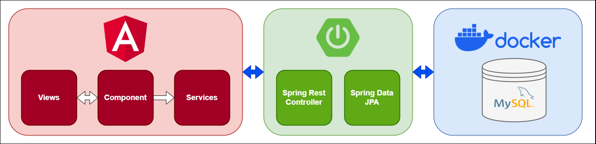

# My Bike Studio

&nbsp;&nbsp;&nbsp;&nbsp;&nbsp;&nbsp;This is a REST API based application designed to store information about your favorite bikes. The project utilizes Angular, Spring Boot, and MySQL. Its primary objectives are to practice and learn new technologies.

## Description
&nbsp;&nbsp;&nbsp;&nbsp;&nbsp;&nbsp;The first steps in the development of the projects were to setup the the Spring Boot environment in my pc. Afterward, I start creating the Model, Implementation, Service and Controller files. Then, I had to setup the Database in MySQL and create the table. When finish with the DB, I started testing the HTTP calls. The test was succesful so I started with the development of the client side by setting up the Angular environment and then started building the Model, Interface, Service and Components. Finally, I finished the project with every functionality working correctly.

## Tools & Technologies
* Frontend - [Angular](https://angular.io/)
* Backend - [Spring Boot](https://spring.io/projects/spring-boot)
* Containerization - [Docker](https://www.docker.com/), [Docker Compose](https://docs.docker.com/compose/)
* Database - [MySQL](https://www.mysql.com/)
* API Testing - [Postman](https://www.postman.com/)
* CSS Framework - [Bulma](https://bulma.io/)

## UI

 

 

## Architecture

## Angular Code

### Bike Model TS
    export class Bike {
        id: number | undefined;
        brand: string | undefined;
        description: string | undefined;
        image: string | undefined;

        Constructor(id: number, brand: string, description: string, image: string) {
            this.id = id;
            this.brand = brand;
            this.description = description;
            this.image = image;
        }
    }

### Bike Interface TS
    export interface Bike {
        id: number;
        brand: string;
        description: string;
        imagelink: string;
    }

### Bike Service TS
    @Injectable({
        providedIn: 'root'
    })
    export class BikeService {

        private apiUrl = environment.apiUrl;

        constructor(private http: HttpClient) { }

        getBikes(): Observable<Bike[]>{
            return this.http.get<Bike[]>(`${this.apiUrl}/bikes`)
            .pipe(
            catchError(this.handleError<Bike[]>('getBikes', []))
            );
        }

        getBikeById(id: number): Observable<Bike>{
            const customUrl = `${this.apiUrl}/bikes/${id}`;
            return this.http.get<Bike>(customUrl)
            .pipe(
            tap(_ => console.log(`Get bike id=${id}`)),
            catchError(this.handleError<Bike>(`getBikeById id=${id}`))
            );
        }

        addBike(bike: Bike): Observable<Bike>{
            const customUrl = `${this.apiUrl}/bikes/add`;
            return this.http.post<Bike>(customUrl, bike)
            .pipe(
            tap(_ => console.log(`Adding new Bike`)),
            catchError(this.handleError<Bike>(`Adding new Bike`))
            );
        }

        updateBike(bike: Bike, id: number): Observable<Bike>{
            const customUrl = `${this.apiUrl}/bikes/update/${id}`;
            return this.http.put<Bike>(customUrl, bike)
            .pipe(
            tap(_ => console.log(`Update bike id=${id}`)),
            catchError(this.handleError<Bike>(`updateBike id=${id}`))
            );
        }

        deleteBike(id: number): Observable<unknown>{
            const customUrl = `${this.apiUrl}/bikes/delete/${id}`;
            return this.http.delete(customUrl)
            .pipe(
            tap(_ => console.log(`Delete bike id=${id}`)),
            catchError(this.handleError<Bike>(`Delete bike id=${id}`))
            );
        }

        private handleError<T>(operation = 'operation', result?: T) {
            return (error: any): Observable<T> => {

            // TODO: send the error to remote logging infrastructure
            console.error(error); // log to console instead

            // TODO: better job of transforming error for user consumption
            console.log(`${operation} failed: ${error.message}`);

            // Let the app keep running by returning an empty result.
            return of(result as T);
            };
        }
    }

### App Component TS
    @UntilDestroy()
    @Component({
        selector: 'app-bikes',
        standalone: true,
        imports: [RouterModule],
        templateUrl: './bikes.component.html',
        styleUrl: './bikes.component.scss'
    })

    export class BikesComponent implements OnInit{

        bikes: Bike[] | undefined;

        constructor(private bikeService: BikeService) { }

        ngOnInit(): void {

            this.bikeService.getBikes()
            .pipe(
            tap((data: Bike[]) => {
                console.log(data);
                this.bikes = data;
            }),
            untilDestroyed(this)
            ).subscribe();

        }
    }

### App Routes TS
    export const routes: Routes = [
        {
            path: 'bikes',
            component: BikesComponent
        },
        {
            path: 'add-bike',
            component: AddBikesComponent
        },
        {
            path: 'edit-bike/:id',
            component: EditBikesComponent
        },
        {
            path: 'users',
            component: UserComponent
        },
        {
            path: '',
            redirectTo: '/page-not-found',
            pathMatch: 'full'
        },
        {
            path: '**',
            component: PageNotFoundComponent
        },
    ];

## Spring Boot Code

### Bike Model Java
    @Entity
    @Table(name = "bikes")
    public class Bike {

        @Id
        @GeneratedValue(strategy = GenerationType.IDENTITY)
        private int id;

        @Column(name = "Brand")
        private String brand;

        @Column(name = "Description")
        private String description;

        @Column(name = "Imagelink")
        private String imagelink;

        public Bike() {

        }

        public Bike(String brand, String description, String imagelink) {
            this.brand = brand;
            this.description = description;
            this.imagelink = imagelink;
        }

        public int getId() {
            return this.id;
        }

        public void setId(int id) {
            this.id = id;
        }

        public String getBrand() {
            return this.brand;
        }

        public void setBrand(String brand) {
            this.brand = brand;
        }

        public String getDescription() {
            return this.description;
        }

        public void setDescription(String description) {
            this.description = description;
        }

        public String getImagelink() {
            return this.imagelink;
        }

        public void setImagelink(String imagelink) {
            this.imagelink = imagelink;
        }
    }

### Repository Java
    @Repository
    public interface BikeRepository extends JpaRepository<Bike, Integer>{

    }

### Bike Service Java
    @Service
    public class BikeService {

        @Autowired
        private BikeRepository bikeRepository;

        public List<Bike> getBikes(){
            return bikeRepository.findAll();
        }

        public Bike getBikeById(int id){
            return bikeRepository.findById(id).get();
        }

        public Bike addBike(Bike bike){
            return bikeRepository.save(bike);
        }

        public Bike updateBike(Bike bike, int id){
            
            Bike bikeUpdate = bikeRepository.findById(id).get();

            if (Objects.nonNull(bike.getBrand()) && !"".equalsIgnoreCase(bike.getBrand())) {
                bikeUpdate.setBrand(bike.getBrand());
            }
    
            if (Objects.nonNull(bike.getDescription()) && !"".equalsIgnoreCase(bike.getDescription())) {
                bikeUpdate.setDescription(bike.getDescription());
            }

            if (Objects.nonNull(bike.getImagelink()) && !"".equalsIgnoreCase(bike.getImagelink())) {
                bikeUpdate.setImagelink(bike.getImagelink());
            }

            return bikeRepository.save(bikeUpdate);
        }

        public void deleteBike(int bikeId){
            bikeRepository.deleteById(bikeId);
        }
    }

### Bike Controller Java
    @CrossOrigin(origins = "http://localhost:4200/")
    @RestController
    @RequestMapping("api/")
    public class BikeController {

        @Autowired
        private BikeService bikeService;

        @GetMapping("bikes")
        public List<Bike> getBikes() {
            return bikeService.getBikes();
        }

        @GetMapping("bikes/{bikeid}")
        public Bike getBikeById(@PathVariable("bikeid") int bikeid) {
            return bikeService.getBikeById(bikeid);
        }

        @PostMapping("bikes/add")
        public int addBike(@RequestBody Bike bike) {
            bikeService.addBike(bike);
            return bike.getId();
        }

        @PutMapping("bikes/update/{bikeid}")
        public Bike updateBike(@RequestBody Bike bike, @PathVariable("bikeid") int bikeid) {
            bikeService.updateBike(bike, bikeid);
            return bike;
        }

        @DeleteMapping("bikes/delete/{bikeid}")
        public void deleteBike(@PathVariable("bikeid") int bikeid) {
            bikeService.deleteBike(bikeid);
        }
    }
